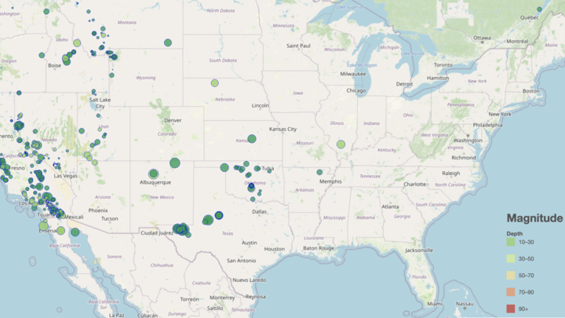

# leaflet-challenge
-Create the Earthquake Visualization

-Create our map, giving it the streetmap
 and earthquakes layers to display on load.
-Perform a GET request to the query URL

-Create a function createFeatures for earthquake data

-Create a Legend

